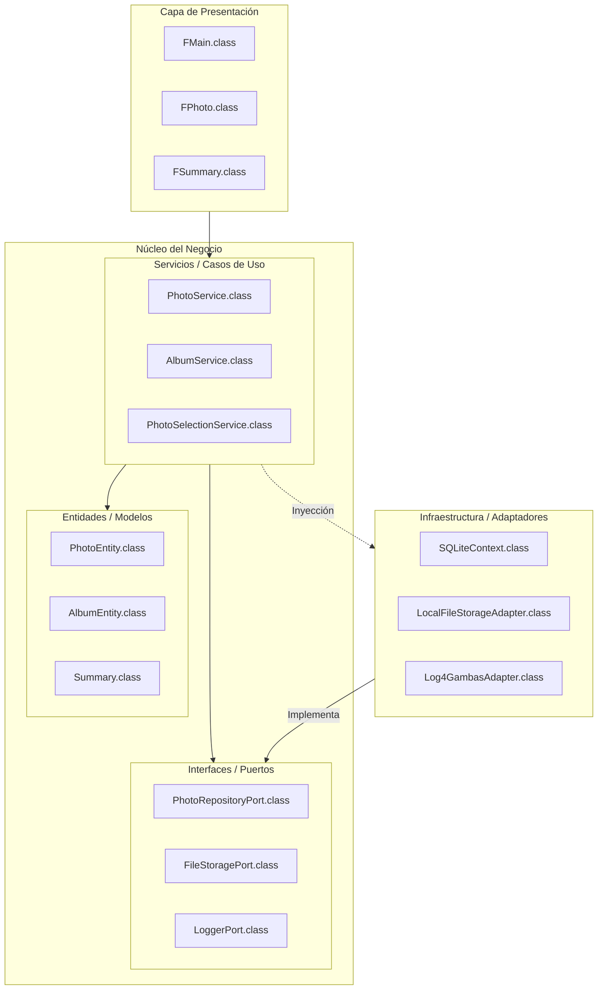

# Especificaciones Técnicas: Gacela 🦌

Este documento detalla el diseño arquitectónico, los patrones de diseño y las decisiones técnicas que rigen el desarrollo de **Gacela**, un gestor de galerías fotográficas multiusuario para Linux desarrollado en **Gambas3**.

## 1. Visión Arquitectónica

Gacela se rige por una **Arquitectura Hexagonal (Clean Architecture)**. El objetivo principal es desacoplar la lógica de negocio (Core) de los detalles de implementación técnica (Infraestructura) y de la interfaz de usuario (Views).

### Diagrama de Arquitectura (Nivel Superior)

## 2. Capas del Sistema

### 2.1 Core (Núcleo)
*   **Domain**: Contiene las entidades puras del negocio (`PhotoEntity`, `AlbumEntity`, `TagEntity`, `Summary`). Estas clases no conocen la base de datos ni la UI.
*   **Ports**: Definiciones de interfaces (Clases abstractas en Gambas). Obligan a los adaptadores a cumplir un contrato.
*   **Services**: Implementan los Casos de Uso. 
    *   `PhotoSelectionService`: Actúa como un **Mediator** centralizado para la selección y acciones masivas.

### 2.2 Infrastructure (Infraestructura)
*   **Adapters**: Implementaciones concretas de los Puertos (BD, Filesystem, Logs).

### 2.3 Views (Presentación)
*   **Principio**: Los formularios son desacoplados del Core. Se comunican a través de servicios o mediadores.
*   **Event-Driven**: Los componentes pequeños (como `FPhoto`) emiten eventos que el contenedor (`FMain`) captura para ejecutar acciones a través del Mediator.

## 3. Principios y Técnicas Aplicadas

### 3.1 SOLID
*   **S (Single Responsibility)**: Cada clase tiene una única razón para cambiar.
*   **D (Dependency Inversion)**: El Core depende de abstracciones (Ports), no de implementaciones concretas.

### 3.2 DRY (Don't Repeat Yourself)
*   **Summary Pattern**: Una sola estructura reporta resultados de cualquier operación (importación, borrado, bloqueo).
*   **Componentización**: Componentes UI reutilizables y aislados.

### 3.3 Patrones de Diseño
*   **Repository Pattern**: Acceso a datos agnóstico.
*   **Mediator Pattern**: `PhotoSelectionService` centraliza la lógica de selección y acciones, evitando que las vistas dependan directamente entre sí.
*   **Adapter Pattern**: Flexibilidad para cambiar proveedores externos (ej: cambiar SQLite por PostgreSQL).

## 4. Convenciones de Desarrollo

### 4.1 Nomenclatura y Lógica
*   **Variables booleanas**: Prefijos `Is`, `Has`, o `Should` (ej: `IsLocked`, `HasThumbnail`).
*   **Lógica Positiva (Positive Affirmation UI)**: Preferir configuraciones que activen comportamientos en lugar de negarlos.
    *   **Correcto:** `Confirmation/AskBeforeDelete = True`
    *   **Incorrecto:** `Settings/DontShowDeleteConfirmation = False`
*   **Documentación IntelliSense**: Uso de `''` para soporte de ayuda en el IDE.

### 4.2 Restricciones Técnicas (Gambas3)
*   **Inhibición de Instanciación Inline**: No se permite `Method(New Class())`. Se debe instanciar a una variable local previa y luego pasarla.
*   **No Herencia en Forms**: Los formularios de Gambas no soportan herencia de clases personalizadas.

---
*Diseñado por el Arquitecto de Software de Gacela*
