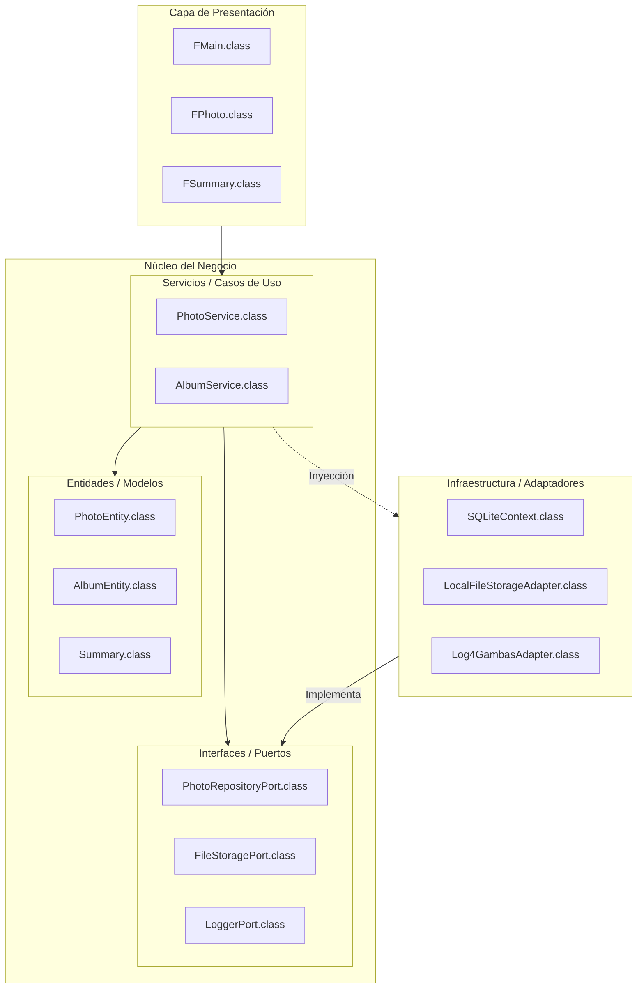

# Especificaciones Técnicas: Gacela 🦌

Este documento detalla el diseño arquitectónico, los patrones de diseño y las decisiones técnicas que rigen el desarrollo de **Gacela**, un gestor de galerías fotográficas multiusuario para Linux desarrollado en **Gambas3**.

## 1. Visión Arquitectónica

Gacela se rige por una **Arquitectura Hexagonal (Clean Architecture)**. El objetivo principal es desacoplar la lógica de negocio (Core) de los detalles de implementación técnica (Infraestructura) y de la interfaz de usuario (Views).

### Diagrama de Arquitectura (Nivel Superior)

## 2. Capas del Sistema

### 2.1 Core (Núcleo)
*   **Domain**: Contiene las entidades puras del negocio (`PhotoEntity`, `AlbumEntity`, `TagEntity`, `Summary`). Estas clases no conocen la base de datos ni la UI; son estructuras de datos con lógica interna mínima.
*   **Ports**: Definiciones de interfaces (Clases abstractas en Gambas). Obligan a los adaptadores de infraestructura a cumplir un contrato (ej: `PhotoRepositoryPort`).
*   **Services**: Implementan los Casos de Uso. Aquí reside la "inteligencia" del sistema (importación, gestión de álbumes, lógica de borrado).

### 2.2 Infrastructure (Infraestructura)
*   **Adapters**: Implementaciones concretas de los Puertos.
    *   `SQLiteContext`: Maneja la persistencia real.
    *   `LocalFileStorageAdapter`: Gestiona el sistema de archivos (thumbnails, carpetas).
    *   `Log4GambasAdapter`: Adaptador para el sistema de logs.

### 2.3 Views (Presentación)
*   Formularios Gambas (`.form`) y su lógica de control (`.class`).
*   **Principio**: Los formularios son "tontos"; solo capturan eventos del usuario y delegan la ejecución a los **Services**.

## 3. Principios y Técnicas Aplicadas

### 3.1 SOLID
*   **S (Single Responsibility)**: Cada clase tiene una única razón para cambiar. Los adaptadores solo manejan datos; los servicios solo manejan lógica.
*   **D (Dependency Inversion)**: El Core no depende de la Infraestructura. Depende de interfaces (Ports). La implementación real se inyecta en tiempo de ejecución (manual DI).

### 3.2 DRY (Don't Repeat Yourself)
*   **Generalización de Resúmenes**: Se refactorizaron las clases de importación a `Summary` y `SummaryItem`. Ahora, una sola estructura reporta resultados de importación, borrado logico, borrado físico y exportación.
*   **Componentización de UI**: Uso de `FPhoto` como un componente reutilizable para representar imágenes en cualquier parte de la aplicación.

### 3.3 Patrones de Diseño
*   **Repository Pattern**: Desacopla la lógica de acceso a datos de los servicios.
*   **Adapter Pattern**: Permite cambiar componentes externos (como el logger o la BD) sin tocar el Core.
*   **Iterator Pattern**: Implementado en la carga de fotos para manejar la paginación de grandes volúmenes de datos.
*   **Mediator/Observer**: Utilizado en el servicio de selección para sincronizar acciones entre diferentes vistas.

## 4. Convenciones de Desarrollo
*   **Nomenclatura**: Uso de prefijos semánticos en variables internas (`$Configuration`, `$Logger`) y parámetros (`cPhotoService`).
*   **Variables booleanas**: Toda variable, propiedad o parámetro booleano debe leerse como una pregunta de sí/no en inglés y comenzar con `Is`, `Has` o `Should`.
    *   Correcto: `hasErrors`, `isDataValid`, `shouldSendEmail`.
    *   Incorrecto: `have_errors`, `data_valid`, `send_email`, `ShowMainToolbar`, `DontShowAgainMoveTrash`.
    *   Regla práctica: si el valor solo puede ser `True` o `False`, su nombre debe responder mentalmente a “¿sí o no?”.
*   **Documentación IntelliSense**: Uso de `''` al final de métodos y constantes para soporte de ayuda en el IDE de Gambas3.
*   **Clean Code**: Métodos cortos, nombres descriptivos y evitación de lógica "mágica" o hardcodeada (uso extensivo de `Constants.module`).

---
*Diseñado por el Arquitecto de Software de Gacela*
